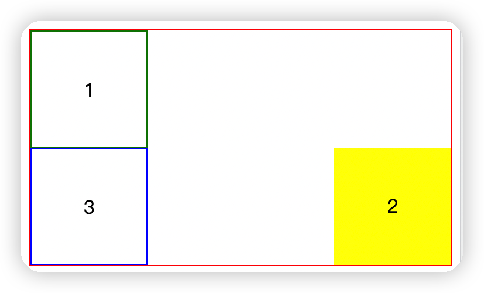
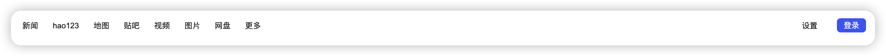

# 利用 float 的实现多行文本省略

## 定义

float CSS 属性指定一个元素应沿其容器的左侧或右侧放置，允许文本和内联元素环绕它。该元素从网页的正常流动（文档流）中移除，但是仍然保持部分的流动性（与绝对定位相反） --MDN

## 使用场景

    1..让inline元素像流水一样围绕着float元素实现浮动布局

## 实例演示

### 例子

#### 知识点 1 float 仅会影响后面元素的布局

整体 html 代码结果如上所示，三个 div 盒子。在将第二个 div 盒子设置成 float 之后，第三个盒子将会上移占据第二个盒子的空间。然而并不会影响第一个盒子的布局。由此可知，float 仅仅会影响**后面**元素的布局。



```html
<div class="container">
  <div class="box box1"></div>
  <div class="box box2"></div>
  <div class="box box3"></div>
</div>
```

```css
.container {
  width: 100%;
  border: 1px solid red;
}

.box {
  width: 100px;
  height: 100px;
  box-sizing: border-box;
  text-align: center;
  line-height: 100px;
}

.box1 {
  border: 1px solid green;
}

.box2 {
  background-color: yellow;
  float: right;
}

.box3 {
  border: 1px solid blue;
}
```

从上面例子也很容易看出，当将盒子设置成 float 的时候。两个 div 盒子可以处在同一行，根据这个特性很容易实现左右导航栏的效果。


1.  将 2 个 ul 盒子分别设置成 float:left 和 float:right

```html
<nav>
  <ul class="left">
    <li>新闻</li>
    <li>hao123</li>
    <li>地图</li>
    <li>贴吧</li>
    <li>更多</li>
  </ul>
  <div class="box box2">
    <ul class="right">
      <li>设置</li>
      <li>登录</li>
    </ul>
  </div>
</nav>
```

```css
.left {
  float: left;
}

.right {
  float: right;
}

ul > li {
  float: left;
  padding: 0 10px;
}

li {
  list-style: none;
}
```


#### 知识点 2 float 会导致父元素高度塌陷

在不将第二个盒子设置为 float 的时，父元素的高度等于三个元素高度之和。当将第二个元素
